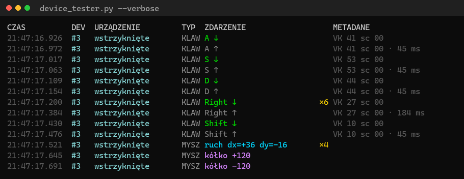
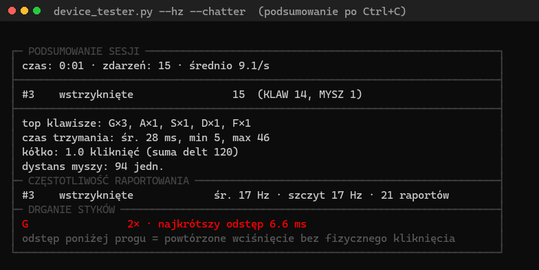
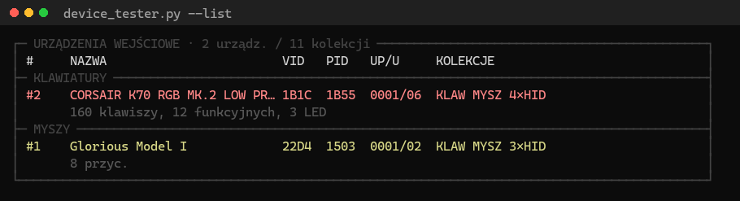
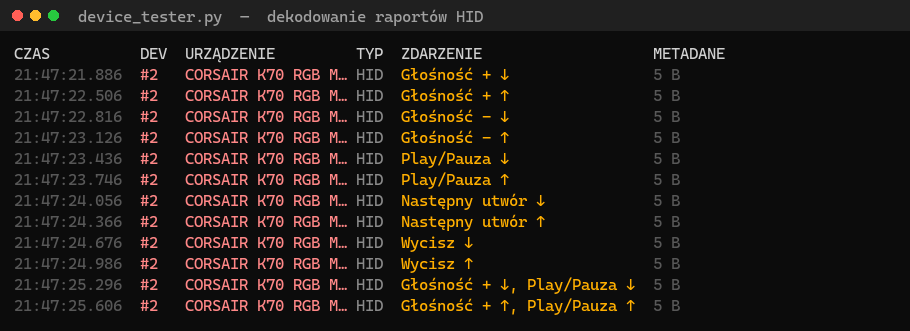
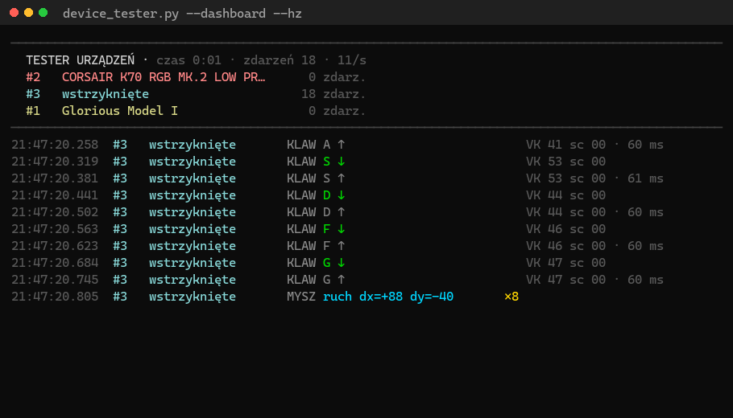

# Device Tester — uniwersalny tester urządzeń wejściowych (Windows)

Jeden plik, zero zależności (tylko standardowy Python + `ctypes`). Pokazuje, **co**
zostało kliknięte / wciśnięte i **z którego urządzenia** to przyszło — dla dowolnego
urządzenia HID: klawiatur, myszy, padów/joysticków, pilotów, urządzeń Bluetooth
udających klawiaturę, klawiszy multimedialnych itd.

Działa na **Windows Raw Input API** — jedynym mechanizmie Windows, który odbiera
wejście ze *wszystkich* urządzeń jednocześnie i mówi, które je wysłało.



Każde fizyczne urządzenie dostaje krótki tag `#N` i własny, stały kolor — powyżej
widać przeplot wstrzykniętych zdarzeń testowych z ruchem prawdziwej myszy.
Powtórzenia są scalane w jedną odświeżaną linię: `×14` przy ruchu myszy pokazuje
**zsumowane** przesunięcie, a nie czternaście identycznych wpisów.

Scalanie obejmuje tylko **kolejne** zdarzenia, bo nadpisać da się wyłącznie ostatnią
linię konsoli. Gdy dwa urządzenia pracują naraz, ich zdarzenia przeplatają się
i każde dostaje własny wiersz — jak `Right ↓` powyżej. Do pliku logu i tak trafia
każde zdarzenie osobno.

## Wymagania

- Windows 10/11
- Python 3.8+ (64-bit zalecany) — sprawdź: `python --version`
- **Nie** wymaga administratora ani instalacji pakietów.

## Uruchomienie

```bash
python device_tester.py                 # nasłuch: klawisze, przyciski, kółko, HID
python device_tester.py --verbose       # dodatkowo ruch myszy i pełne raporty HID
python device_tester.py --list          # tylko wypisz podłączone urządzenia i wyjdź
python device_tester.py --log plik.log  # nasłuch + zapis wszystkiego do pliku na bieżąco
```

Zatrzymanie: **Ctrl+C**. Po zatrzymaniu pojawia się podsumowanie sesji:



Pełną, pogrupowaną listę komend z przykładami pokaże:

```bash
python device_tester.py --help
```

### Wszystkie opcje

| Opcja | Działanie |
|-------|-----------|
| `--verbose`, `-v` | pokazuj też ruch myszy i pełne raporty HID |
| `--list`, `-l` | wypisz urządzenia i zakończ |
| `--paths` | w `--list` pokaż pełne ścieżki wszystkich kolekcji |
| `--log [PLIK]` | zapis na bieżąco; bez nazwy = `device-tester-DATA-CZAS.log` |
| `--jsonl [PLIK]` | eksport strukturalny: jeden obiekt JSON na linię |
| `--csv [PLIK]` | eksport do arkusza: płaskie kolumny |
| `--hz` | mierz częstotliwość raportowania (średnia z okna 1 s) |
| `--chatter [MS]` | wykrywaj drganie styków (domyślny próg 30 ms) |
| `--analog` | paski osi na żywo + raport zasięgu i martwej strefy |
| `--dashboard` | przypięty panel na żywo u góry ekranu |
| `--only TYP` | tylko `keyboard` / `mouse` / `hid` (można powtórzyć) |
| `--device WZORZEC` | tylko wskazane urządzenie: `#2`, `1B1C:1B55` lub fragment nazwy |
| `--exclude WZORZEC` | pomiń wskazane urządzenie (ta sama składnia) |
| `--raw-hid` | nie tłumacz raportów HID — pokaż surowe bajty |
| `--color` / `--no-color` | wymuś lub wyłącz kolory |
| `--no-dedup` | nie scalaj powtórzeń w linię `×N` |
| `--no-summary` | bez podsumowania sesji |
| `--dump-caps` | pełne dane diagnostyczne urządzeń (materiał do zgłoszeń) |
| `--self-test` | testy wewnętrzne, nie wymagają żadnego urządzenia |
| `-h`, `--help` | pogrupowana lista komend z przykładami |

## Jak czytać wyjście

Jedno urządzenie wystawia zwykle kilka kolekcji HID — klawiatura potrafi mieć ich
sześć, a mysz pięć. `--list` zwija je pod wspólnym tagiem, zamiast pokazywać
jedenaście pozycji dla dwóch urządzeń na biurku:



Kolumna **KOLEKCJE** mówi, co urządzenie potrafi wysłać. Gamingowa klawiatura ma
kolekcję myszy (do makr), a mysz kolekcję klawiatury — o przypisaniu do sekcji
decyduje kolekcja główna, nie sam fakt jej posiadania.

- **KLAW** — nazwa klawisza (zlokalizowana), kierunek (↓/↑), kod VK i scancode.
  Przy zwolnieniu pokazywany jest czas trzymania. Lewy i prawy Shift/Ctrl/Alt oraz
  Enter i NumPad Enter są rozróżniane.
- **MYSZ** — przyciski (LPM/PPM/ŚPM/PRZ4/PRZ5) i kółko; ruch tylko w `--verbose`.
  Urządzenia wskazujące w trybie absolutnym (ekran dotykowy, tablet, RDP, maszyna
  wirtualna) pokazują pozycję, nie przesunięcie.
- **HID** (pady, piloty, nietypowe urządzenia) — raport jest tłumaczony na **nazwane
  przyciski i osie** przez bibliotekę HID Parsing systemu Windows:

  

  > Powyższy zrzut powstał z prawdziwego deskryptora (kolekcja Consumer Control
  > podłączonej klawiatury) i prawdziwego `HidP_GetUsages` z `hid.dll`, ale same
  > raporty są syntetyczne: klawisza multimedialnego nie da się wcisnąć programowo,
  > bo `SendInput` idzie ścieżką klawiatury, nie HID. Pad podłączony do komputera
  > dałby w tym miejscu `przycisk 1 ↓` i `X ▕────█───┼────────▏ -16412`.

  Gdy urządzenie nie udostępnia opisu swoich raportów, narzędzie wraca do
  uniwersalnego trybu surowego: pokazuje, **które bajty się zmieniły** względem
  poprzedniego raportu **o tym samym Report ID**. Ten tryb można wymusić przez
  `--raw-hid`, a w `--verbose` widać cały raport w hex:

  ```
  10:47:40.550  #3   Xbox Wireless Cont… HID  rid=01 [3] 7F→FF [9] 00→01    14 B
  ```

  Osie analogowe są w trybie domyślnym filtrowane progiem 1/64 zakresu — bez tego
  szum spoczynkowy drążka zalewałby ekran. `--verbose` pokazuje każdą zmianę.
- **`×N`** — powtórzenia (np. autorepeat klawisza) są scalane w jedną linię, która
  jest odświeżana w miejscu. Ruch myszy sumuje wtedy przesunięcia, a pozycja
  absolutna pokazuje bieżącą wartość. Do pliku logu trafia każde zdarzenie osobno.
  Scalanie wyłącza się samo dla linii, które nie mieszczą się w jednym wierszu
  (np. długi raport HID) — nadpisywanie zawiniętej linii uszkodziłoby ekran.

Treść zdarzenia nigdy nie jest obcinana: pełny raport HID wypisze się w całości,
nawet jeśli rozleje się poza szerokość okna. Docinana bywa wyłącznie kolumna
metadanych i nazwa urządzenia (nazwę w całości pokaże `--list`).

### Kolory

Włączane automatycznie, gdy wyjście jest konsolą obsługującą sekwencje ANSI.
Respektowane są `--no-color` oraz zmienna `NO_COLOR`. Przy przekierowaniu wyjścia
do pliku lub potoku kolory są wyłączane. **Do pliku `--log` kolory nie trafiają
nigdy** — plik zawsze dostaje czysty tekst.

### Logowanie do pliku (`--log`)

Zapisuje zdarzenia **na bieżąco, zaraz po wystąpieniu każdego z nich** (flush po
każdej linii), a nie dopiero na koniec. Dzięki temu nawet jeśli program zostanie
ubity, w pliku są wszystkie zdarzenia aż do ostatniej chwili. Plik otwierany jest
w trybie dopisywania (`append`) — kolejne uruchomienia nie nadpisują poprzedniego
logu. Błąd zapisu logu (np. brak uprawnień, zapełniony dysk) nie przerywa nasłuchu —
narzędzie ostrzega raz i działa dalej.

Zawartość logu **nie zależy od szerokości okna konsoli**. Na wąskiej konsoli kolumna
metadanych bywa docięta na ekranie, ale do pliku trafia zawsze pełna wersja — log ma
być wiarygodnym zapisem sesji, a nie zrzutem tego, co akurat się zmieściło.

Powtórzenia **nie** są w logu scalane: indywidualne znaczniki czasu powtórzeń są
danymi diagnostycznymi (częstotliwość autorepeat, drgania styków).

Nasłuch działa też, gdy okno terminala **nie ma fokusu** (`RIDEV_INPUTSINK`) — możesz
klikać w innych aplikacjach i nadal widzieć zdarzenia. Podłączanie/odłączanie urządzeń
w trakcie działania jest wykrywane na żywo.

## Co jest łapane

Rejestrowane top-level HID collections:

| UsagePage | Usage | Urządzenia |
|-----------|-------|------------|
| 0x01 | 0x02, 0x04, 0x05, 0x06, 0x07 | mysz, joystick, gamepad, klawiatura, keypad |
| 0x01 | 0x08, 0x09, 0x0C, 0x0E, 0x0F | kontroler wieloosiowy, przyciski 2-in-1, radio, spatial |
| 0x01 | 0x80 | System Control (power/sleep/wake) |
| 0x03 | 0x04–0x07 | VR: rękawica, head tracker, HMD, hand tracker |
| 0x05 | 0x01–0x03 | kontroler 3D, flipper, light gun |
| 0x0C | 0x01, 0x03 | piloty i klawisze multimedialne, przyciski programowalne |
| 0x0D | 0x01, 0x02, 0x04, 0x05 | digitizer, rysik, ekran dotykowy, touchpad Precision |

Każda para rejestrowana osobno — jeśli jedna zawiedzie, reszta działa dalej.

## Diagnostyka sprzętu

### Częstotliwość raportowania (`--hz`)

```bash
python device_tester.py --hz --device 22D4:1503
```

Raz na sekundę wypisuje wiersz `HZ` z liczbą raportów w oknie, a w podsumowaniu
średnią i szczyt per urządzenie. Podawana jest **wyłącznie średnia z okna** (n/Δt).
Mediana i percentyle odstępów kuszą, ale mierzyłyby ścieżkę dostarczania zdarzenia
do procesu, a nie sprzęt — znacznik czasu powstaje w chwili odbioru `WM_INPUT`.
`RID_DEVICE_INFO_MOUSE.dwSampleRate` nie jest używane, bo dla myszy USB zwraca 0.

### Drganie styków (`--chatter`)

```bash
python device_tester.py --chatter --only mouse
```

Zużyty mikroswitch „odbija": jedno fizyczne kliknięcie daje kilka par
naciśnięcie/zwolnienie w odstępie kilku milisekund. Zdarzenie, które przyszło
szybciej niż próg (domyślnie 30 ms) po zwolnieniu tej samej kontrolki, jest
oznaczane w wierszu jako `DRGANIE 4.2 ms` i zliczane w podsumowaniu.

Autorepeat klawiatury (powtórzone MAKE bez BREAK) nie jest liczony jako drganie.
Pomiar dotyczy czasu **dostarczenia** zdarzenia, więc wynik jest przybliżeniem od
góry — pojedyncze trafienie tuż pod progiem nie musi oznaczać usterki, ale
kilkanaście trafień na jednym przycisku już tak.

### Osie analogowe (`--analog`)

```bash
python device_tester.py --analog --device 045E:02EA
```

Do każdej zmiany osi dokłada pasek pozycji, a w podsumowaniu podaje zasięg i
martwą strefę:

```
10:47:40.550  #3   Xbox Wireless Cont… HID  X ▕────█───┼────────▏ -16412
```

```
├─ OSIE ANALOGOWE ─────────────────────────────────────────────────────────────┤
│ #3    X                                                                      │
│       zasięg -32100..32200 z -32768..32767 (98%)                             │
│       spoczynek -180..210 (martwa strefa 0.6% zakresu)                       │
```

Narzędzie **nie zakłada, gdzie oś powinna spoczywać** — drążek centruje się
w środku zakresu, a spust w jego dolnym końcu. Zamiast zgadywać, mierzony jest pas
wartości obserwowany wtedy, gdy oś stoi nieruchomo: jego szerokość to martwa
strefa, której urządzenie realnie potrzebuje. Szeroki pas przy nietkniętym drążku
oznacza dryf. `zasięg` mówi, czy oś sięga pełnego wychylenia — po kalibracji
powinno być blisko 100%.

### Panel na żywo (`--dashboard`)

```bash
python device_tester.py --dashboard --hz --log sesja.log
```



Rezerwuje górę ekranu na nieruchomy panel (liczniki, Hz, paski osi), a zdarzenia
przewijają się poniżej. Zrealizowane regionem przewijania terminala (DECSTBM),
bez żadnej biblioteki TUI. Panel zajmuje dokładnie tyle wierszy, ile ma treści,
i rośnie, gdy pojawią się nowe urządzenia albo osie.

Dwa zastrzeżenia:

- **Linie wypchnięte poza region nie trafiają do bufora przewijania terminala.**
  Po sesji zobaczysz tylko ostatni ekran, dlatego narzędzie przypomina o `--log`.
- Wymaga konsoli obsługującej ANSI i co najmniej 12 wierszy; przy przekierowaniu
  wyjścia do pliku panel jest pomijany z ostrzeżeniem, a nie włączany na siłę.

Zatrzymanie przez Ctrl+C przywraca terminal do stanu wyjściowego. Jeśli proces
zostanie ubity twardo (nie ma jak tego przechwycić), region przewijania może
zostać ustawiony — naprawia to polecenie `reset` albo nowe okno terminala.

## Eksport (`--jsonl`, `--csv`)

Log tekstowy nadaje się do czytania, nie do liczenia. Eksport strukturalny daje
pola zamiast sformatowanych napisów:

```json
{"time": "2026-07-29T10:47:38.180", "kind": "KLAW", "body": "A ↑",
 "meta": "VK 41 sc 1E · 65 ms",
 "device": {"tag": "#2", "name": "CORSAIR K70…", "type": "KEYBOARD",
            "vid": "1B1C", "pid": "1B55", "usage_page": "0001", "usage": "0006"},
 "key": "A", "down": false, "hold_ms": 65}
```

JSONL jest strumieniowy — przerwanie procesu nie psuje wcześniejszych rekordów,
w przeciwieństwie do jednej wielkiej tablicy JSON. CSV dopisuje nagłówek tylko
przy tworzeniu pliku, więc kolejne uruchomienia dokładają wiersze.

## Testy

```bash
python device_tester.py --self-test
python -m unittest discover -s tests -v
```

`--self-test` sprawdza logikę bez żadnego urządzenia (rozmiary struktur, dekodowanie
raportów HID, renderowanie, grupowanie, filtry). Zestaw w `tests/` dokłada test całej
ścieżki live: zdarzenia wstrzykiwane przez `SendInput` przechodzą przez okno
komunikatów, dekodery i wyjście. Używane są wyłącznie klawisze F13-F15, więc test
nie wpisuje niczego w aktywne okno.

### Zrzuty ekranu

Obrazki w tym pliku są generowane z **prawdziwych** uruchomień narzędzia:

```bash
pip install pillow
python docs/make_screenshots.py
```

`docs/make_screenshots.py` przechwytuje wyjście wraz z sekwencjami ANSI, odtwarza je
w minimalnym emulatorze terminala i renderuje siatkę znaków do PNG — dlatego zrzuty
pokazują też panel na żywo i nadpisywanie linii przy scalaniu `×N`. Pillow jest
potrzebny wyłącznie do generowania zrzutów; samo `device_tester.py` nadal nie ma
żadnych zależności.

## Ograniczenia

- Tylko Windows (Raw Input to API Windows).
- Przyciski są numerowane zgodnie z deskryptorem HID (`przycisk 1`, `przycisk 2`…).
  Narzędzie **nie zgaduje** nazw producenta — żeby dowiedzieć się, że `przycisk 1`
  to „A" na padzie Xbox, wciśnij go i odczytaj numer.
- Kolekcje vendorowe (strony `0xFF00`+) nie mają publicznego znaczenia usage, więc
  dla nich pozostaje surowy diff bajtów.
- Urządzenia są grupowane po `VID:PID` (obsługiwany jest też format ścieżek
  Bluetooth), więc dwie sztuki tego samego modelu zlewają się w jeden wpis. Ścieżka
  Raw Input nie niesie informacji o porcie USB, więc nie da się ich rozdzielić
  automatycznie — pełne ścieżki poszczególnych kolekcji pokaże `--list --paths`.
- Kolejka raw input Windows ma twardy limit ~10000 nieodebranych komunikatów; przy
  ekstremalnym napływie zdarzeń nadmiar znika bez śladu w API. Narzędzie ostrzega,
  gdy wykryje bardzo duży napływ, ale nie potrafi podać liczby utraconych zdarzeń.
- Czas trzymania klawisza, `--hz` i `--chatter` mierzą moment **dostarczenia**
  zdarzenia do procesu, a nie moment zdarzenia w sprzęcie.
- Zdarzenia są odbierane pojedynczo (`GetRawInputData`), nie paczkami
  (`GetRawInputBuffer`). Paczkowanie byłoby szybsze przy myszy 1000/8000 Hz, ale
  cała paczka dostałaby jeden znacznik czasu, co zepsułoby `--hz` i `--chatter`.
- `--analog` widzi tylko osie opisane w deskryptorze HID. Osie myszy to zwykłe
  zdarzenia `MYSZ` (przesunięcia względne), a nie osie analogowe, więc nie
  pojawiają się w raporcie martwej strefy.

## Rozwój i wydania

Praca toczy się na `develop`, `master` zawiera wyłącznie stan wydany.
**Wersję wydaje się przez podniesienie numeru w [VERSION.md](VERSION.md)** — nie
zakłada się tagów ręcznie:

1. na `develop` podnieś numer w `VERSION.md` i opisz zmiany w `CHANGELOG.md`
   pod `## [Nieopublikowane]`,
2. scal PR `develop` → `master`,
3. automat przenosi wpis CHANGELOG-a pod nowy numer, synchronizuje `__version__`
   w kodzie, zakłada tag i publikuje release.

Scalenie bez zmiany `VERSION.md` niczego nie wydaje. Artefaktem wydania jest sam
plik `device_tester.py` — to cały program.

Szczegóły: [RELEASING.md](RELEASING.md) · historia zmian: [CHANGELOG.md](CHANGELOG.md).

```bash
python device_tester.py --version        # wersja narzędzia i środowiska
python tools/release_tools.py check      # czy obecny stan da się wydać
```

## Licencja

[MIT](LICENSE) — możesz używać, modyfikować i rozpowszechniać, także komercyjnie,
zachowując informację o prawach autorskich. Bez gwarancji.
